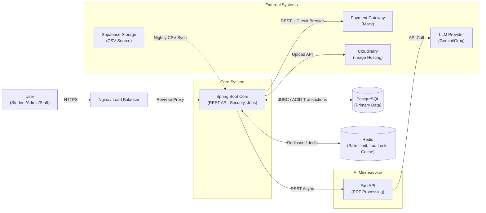

# 🏢 UniHub-Workshop 


**UniHub-Workshop** là một hệ thống quản lý hội thảo (workshop) toàn diện dành cho môi trường đại học. Hệ thống hỗ trợ từ việc quản lý địa điểm (phòng học/hội trường), lập lịch workshop, đăng ký tham gia, điểm danh bằng mã QR, đến việc tự động tóm tắt nội dung bằng AI.

---

## 🛠️ Công nghệ sử dụng

| Thành phần | Công nghệ | Mô tả |
|---|---|---|
| Backend (Core Service) | Java | Ngôn ngữ chính cho hệ thống backend |
|  | Spring Boot | Framework xây dựng RESTful API và xử lý nghiệp vụ |
|  | PostgreSQL | Cơ sở dữ liệu chính của hệ thống |
|  | Flyway | Quản lý migration database |
|  | Redis | Cache session và dữ liệu tạm thời |
|  | Spring Security + JWT | Xác thực và phân quyền Stateless JWT |
|  | Swagger | Tài liệu hóa API |
|  | Docker | Container hóa backend service |
|  | Cloudinary | Lưu trữ và quản lý hình ảnh |
|  | Supabase | Hosting PostgreSQL và lưu trữ file CSV |
| AI Microservice | FastAPI | Xây dựng AI service độc lập |
|  | Gemini API / Groq API | Tích hợp mô hình LLM cho các chức năng AI |
|  | PyPDF2 / pdfplumber | Xử lý và trích xuất nội dung PDF |
|  | Docker Internal Network | AI service hoạt động độc lập theo kiến trúc microservice bất đồng bộ |
| Frontend (Web Admin) | React + Vite | Xây dựng giao diện web quản trị |
|  | Tailwind CSS | Thiết kế giao diện responsive hiện đại |
|  | Recharts | Hiển thị biểu đồ và thống kê |
|  | React Context API | Quản lý state phía client |
| Mobile Application | Android Native (Java) | Ứng dụng mobile quét mã điểm danh workshop |

---

## ✨ Tính năng nổi bật

### 🖥️ Hệ thống (Core Infrastructure)
- **Kiểm soát tải & Zero-Overbooking:** Áp dụng Rate Limiting chặn spam và dùng Redis Lua Script xử lý tranh chấp ghế đồng thời (Seat Contention), đảm bảo chịu tải cao và tuyệt đối không bán lố vé.

- **Chống trừ tiền hai lần (Idempotency):** Bảo vệ các giao dịch tài chính thông qua Idempotency Key lưu trên Redis, đảm bảo an toàn tuyệt đối ngay cả khi người dùng spam nút thanh toán hoặc rớt mạng.

- **Tự phục hồi & Chịu lỗi (Fault Tolerance):** Tích hợp Circuit Breaker bảo vệ luồng chính không bị sập dây chuyền khi cổng thanh toán hoặc các API bên ngoài gặp sự cố (Timeout/Unavailable).

- **Hệ thống thông báo Đa kênh:** Phát luồng sự kiện bất đồng bộ (Event-Driven) để gửi thông báo qua Email, Telegram và In-app khi đăng ký thành công, nhắc lịch lúc 18h hằng ngày hoặc khi workshop bị hủy.

### 👨‍💼 Quản trị viên (Admin Dashboard)
- **Quản lý Workshop:** Tạo, chỉnh sửa, xuất bản hoặc hủy các workshop. Theo dõi trạng thái thời gian thực.

- **Quản lý Phòng:** Quản lý sức chứa và sơ đồ mặt bằng (floor maps) được lưu trữ trên Cloudinary.

- **AI Summary:** Tự động tóm tắt nội dung và trích xuất tên diễn giả từ file PDF giới thiệu workshop bằng mô hình ngôn ngữ lớn (LLM).

- **Thống kê chuyên sâu:** Theo dõi doanh thu, tỷ lệ lấp đầy phòng và xu hướng đăng ký thông qua biểu đồ trực quan (Recharts).

- **Đồng bộ sinh viên:** Tự động đồng bộ danh sách sinh viên từ file CSV trên Supabase Storage.

### 🎓 Sinh viên (Student Dashboard)
- **Khám phá Workshop:** Xem danh sách các workshop sắp diễn ra, lọc theo chủ đề hoặc thời gian.

- **Đăng ký & Thanh toán:** Quy trình đăng ký nhanh chóng với tích hợp giả lập cổng thanh toán.

- **Điểm danh:** Sử dụng mã QR để điểm danh nhanh tại sảnh workshop.

- **Theo dõi lịch trình:** Quản lý danh sách các workshop đã đăng ký và trạng thái thanh toán.

- **Liên kết Telegram:** Kết nối tài khoản UniHub với Telegram bot của hệ thống chỉ bằng 1 cú click và nhận thông báo trực tiếp qua tài khoản Telegram này.

### 📱 Nhân sự check-in (Android Offline-First)
- **Quét mã QR Offline-first:** Ứng dụng Android cho phép tải trước danh sách mã QR hợp lệ về thiết bị (SQLite), hỗ trợ nhân viên quét mã điểm danh mượt mà ngay cả khi mất kết nối mạng (No Internet).

- **Đồng bộ thông minh:** Tự động phát hiện khi có mạng và đồng bộ dữ liệu điểm danh lên máy chủ (PostgreSQL) theo batch, hoặc cho phép đồng bộ thủ công.

- **Kiểm tra gian lận vé:** Phát hiện ngay lập tức vé giả, vé không thuộc sự kiện hoặc vé đã được quét trước đó (tránh check-in trùng lặp).

---

## 📂 Cấu trúc dự án

```text
UniHub-Workshop/
├── backend/            # Spring Boot Core API
├── frontend/           # React Admin Dashboard
├── mobile/             # Native Android App (Java)
├── ai-service/         # FastAPI Microservice (AI Processing)
├── blueprint/          # Tài liệu đặc tả & Specs kỹ thuật
│   └── specs/          # Chi tiết nghiệp vụ (Authentication, AI, Attendance...)
└── docker-compose.yml  # Cấu hình Docker (Redis, DB, ...)
```

---

## 🏗️ Kiến trúc hệ thống



---

## 🔧 Yêu cầu môi trường

---

## 🚀 Cài đặt và Chạy dự án

Hệ thống yêu cầu cài đặt sẵn: `Java 21`, `Node.js 22+`, `Python 3.10+`, `Docker` & `Docker Compose`.
Trước khi chạy, hãy copy các file `.env.example` thành `.env` và điền đầy đủ các thông số (Database, Cloudinary, Telegram Token, JWT Secret,...).

### Phương án 1: Chạy bằng Docker (Khuyên dùng cho Production/Test nhanh)
Chỉ với 1 lệnh duy nhất, Docker sẽ tự động build và chạy toàn bộ hệ thống (Frontend, Backend, AI Service, Database, Redis, Nginx).

```bash
# Trỏ đến file cấu hình môi trường production và khởi chạy
docker-compose --env-file .env.production up -d --build

Sau khi chạy xong, truy cập Web App tại: http://localhost (Nginx đã tự động handle port 80).
```

### Phương án 2: Chạy thủ công (Khuyên dùng cho Development)
Bật các service bên thứ 3 (PostgreSQL, Redis) bằng Docker trước, sau đó chạy từng module:

1. Khởi động AI Microservice (FastAPI):
```bash
cd ai-service
pip install -r requirements.txt
uvicorn main:app --reload --port 8000
```

2. Khởi động Backend Core (Spring Boot):
```bash
cd backend
./mvnw spring-boot:run
```

3. Khởi động Frontend Web (React):

```bash
cd frontend
npm install
npm run dev
```

---
<div align="center">
  <b>Develped by the UniHub Team</b><br>
  <i>Advanced Agentic Coding Project - 2026</i><br><br>
  
  [](https://opensource.org/licenses/MIT)
  [](#)
</div>
