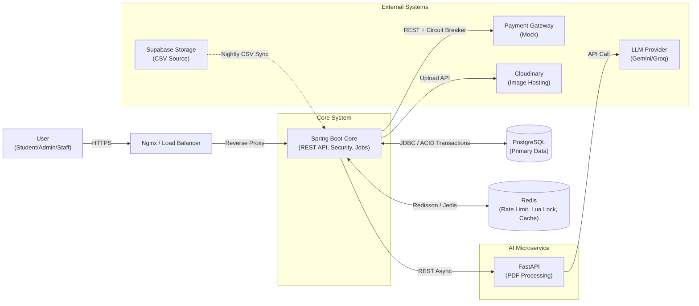

# UniHub Workshop — Technical Design

## Kiến trúc tổng thể
Hệ thống sử dụng mô hình Modular Monolith kết hợp Event-Driven & AI Microservice.

- Core API xây dựng bằng `Java Spring Boot` để tận dụng khả năng quản lý Transaction chặt chẽ cho luồng đăng ký và thanh toán.

- Service xử lý AI xây dựng bằng Python FastAPI, chạy độc lập để xử lý các file PDF nặng không làm ngắt luồng chính.

- Giao tiếp: Core API gọi FastAPI qua REST.

## C4 Diagram

### Level 1 — System Context

- Người dùng: Sinh viên (Web User), Ban tổ chức (Web Admin), Staff (Mobile App).

- Hệ thống chính: UniHub Workshop System.

- Hệ thống ngoài: Quản lý sinh viên - cung cấp CSV (University Student Management), Cổng thanh toán (Payment Gateway - Mock), LLM Provider (Gemini/Groq/DeepSeek API), Hệ thống thông báo (Notification System - Email, Telegram, ...).

  

### Level 2 — Container

- Frontend Web: React.js SPA.

- Mobile App: Native Android Client (Java) - tích hợp SQLite để lưu trữ local.

- Core Backend: Spring Boot ứng dụng Layered Architecture (Controller, Service, Repository).

- AI Microservice: FastAPI.

- Primary Database: PostgreSQL.

- In-memory Cache & Lock: Redis.

  

## High-Level Architecture Diagram

## Thiết kế cơ sở dữ liệu
Lựa chọn: PostgreSQL (Relational DB).

Lý do: Đảm bảo tính ACID tuyệt đối cho luồng tài chính và số lượng vé. Hệ thống không có nhu cầu linh hoạt schema (NoSQL) mà ưu tiên sự toàn vẹn dữ liệu.

### Database Schema

Hệ thống sử dụng PostgreSQL để đảm bảo tính toàn vẹn dữ liệu (ACID) cho các giao dịch đăng ký và thanh toán.

#### 1. Bảng `users` (Thông tin người dùng)

Lưu trữ thông tin sinh viên và tài khoản quản trị, hỗ trợ kiểm tra với dữ liệu CSV của trường.

| Column | Type | Constraint | Description |
| :--- | :--- | :--- | :--- |
| `id` | SERIAL | PRIMARY KEY | ID tự tăng |
| `student_code` | VARCHAR(20) | UNIQUE, NULLABLE | Mã số sinh viên (kiểm tra CSV) |
| `full_name` | VARCHAR(100) | NOT NULL | Họ và tên |
| `email` | VARCHAR(100) | UNIQUE, NOT NULL | Email đăng nhập & nhận thông báo (kiểm tra CSV) |
| `phone_number` | VARCHAR(20) | UNIQUE | Số điện thoại của người dùng |
| `password` | VARCHAR(255) | NULLABLE | Mật khẩu đã mã hóa (BCrypt) |
| `role` | VARCHAR(20) | NOT NULL | Quyền: `STUDENT`, `ADMIN`, `STAFF` |
| `status` | VARCHAR(20) | DEFAULT `INACTIVE` | Trạng thái: `ACTIVE`, `INACTIVE` |
| `chat_id` | VARCHAR(255) | - | ID của Telegram Chat Bot |

#### 2. Bảng `workshops` (Thông tin sự kiện)

Quản lý thông tin chi tiết và số lượng chỗ ngồi của workshop.

| Column | Type | Constraint | Description |
| :--- | :--- | :--- | :--- |
| `id` | SERIAL | PRIMARY KEY | ID tự tăng |
| `title` | VARCHAR(255) | NOT NULL | Tiêu đề workshop |
| `description` | TEXT | - | Mô tả chi tiết (Tự tạo hoặc dùng AI tóm tắt) |
| `room_id` | INTEGER | FOREIGN KEY | Tham chiếu đến `rooms(id)` |
| `speaker` | VARCHAR(255) | DEFAULT 'TBD' | Diễn giả/diễn giả chính |
| `status` | VARCHAR(20) | NOT NULL | Trạng thái: `DRAFT`, `PUBLISHED`, `CANCELLED`, `COMPLETED` |
| `total_slots` | INTEGER | NOT NULL | Tổng số ghế (VD: 60) |
| `remaining_slots`| INTEGER | NOT NULL | Số ghế còn lại (Đồng bộ với Redis) |
| `price` | BIGINT | DEFAULT 0 | Giá vé (nếu có phí) |
| `start_time` | TIMESTAMP | NOT NULL | Thời gian bắt đầu sự kiện |
| `end_time` | TIMESTAMP | NOT NULL | Thời gian kết thúc sự kiện |
| `registration_start_time` | TIMESTAMP | NOT NULL | Thời gian bắt đầu cho phép sinh viên click đăng ký |
| `registration_end_time` | TIMESTAMP | NOT NULL | Thời gian đóng form đăng ký |

**Ràng buộc DB:**
  + registration_start_time < registration_end_time
  + start_time < end_time

**Ràng buộc Application:**
  + start_time, end_time diễn ra cùng 1 ngày
  + remaining_slots ≤ total_slots ≤ capacity (của rooms)

#### 2.1 Bảng `rooms` (Phòng tổ chức)

Lưu thông tin phòng và sơ đồ chỗ ngồi.

| Column | Type | Constraint | Description |
| :--- | :--- | :--- | :--- |
| `id` | SERIAL | PRIMARY KEY | ID tự tăng |
| `name` | VARCHAR(100) | UNIQUE, NOT NULL | Tên phòng |
| `layout_map_url` | VARCHAR(1024) | NULLABLE | Sơ đồ phòng (URL hoặc JSON) |
| `capacity` | INTEGER | NOT NULL | Sức chứa tối đa |

#### 3. Bảng `registrations` (Đăng ký tham dự)

Entity kết nối sinh viên và workshop.

| Column | Type | Constraint | Description |
| :--- | :--- | :--- | :--- |
| `id` | SERIAL | PRIMARY KEY | ID tự tăng |
| `user_id` | INTEGER | FOREIGN KEY | Tham chiếu đến `users(id)` |
| `workshop_id` | INTEGER | FOREIGN KEY | Tham chiếu đến `workshops(id)` |
| `qr_code` | VARCHAR(255) | UNIQUE, NOT NULL | Mã định danh dùng để check-in |
| `status` | VARCHAR(20) | NOT NULL | Trạng thái: `PENDING`, `SUCCESS`, `CANCELLED` |
| `created_at` | TIMESTAMP | DEFAULT NOW() | Thời điểm bấm đăng ký |

#### 4. Bảng `payments` (Giao dịch tài chính)

Đảm bảo chống trừ tiền hai lần thông qua `idempotency_key`.

| Column | Type | Constraint | Description |
| :--- | :--- | :--- | :--- |
| `id` | SERIAL | PRIMARY KEY | ID tự tăng |
| `registration_id` | INTEGER | UNIQUE, FK | Mỗi đăng ký chỉ có tối đa 1 thanh toán |
| `amount` | BIGINT | NOT NULL | Số tiền thanh toán thực tế |
| `idempotency_key`| VARCHAR(255) | UNIQUE, NOT NULL | Key chống spam/retry từ Client |
| `transaction_id` | VARCHAR(255) | - | Mã giao dịch từ Mock Gateway |
| `status` | VARCHAR(20) | NOT NULL | `PENDING`, `COMPLETED`, `FAILED` |

#### 5. Bảng `checkin_records` (Ghi nhận tham dự)

Xử lý check-in offline và đồng bộ dữ liệu.

| Column | Type | Constraint | Description |
| :--- | :--- | :--- | :--- |
| `registration_id` | INTEGER | PRIMARY KEY, FK | Đảm bảo 1 vé chỉ check-in 1 lần (Idempotency) |
| `scanned_at` | TIMESTAMP | NOT NULL | Thời gian quét thực tế tại App |
| `synced_at` | TIMESTAMP | DEFAULT NOW() | Thời gian server nhận được data sync |

#### 6.Bảng `notifications` (Thông báo)

Hệ thống sử dụng một bảng duy nhất để lưu trữ lịch sử phát thông báo. Để đáp ứng yêu cầu hiển thị chi tiết trên giao diện Web App giống hệt nguyên bản nội dung gửi qua Email, hệ thống sẽ lưu trữ trực tiếp mã HTML đã được render từ Template Engine.

| Column | Type | Constraint | Description |
| :--- | :--- | :--- | :--- |
| `id` | SERIAL | PRIMARY KEY | Định danh duy nhất tự tăng. |
| `user_id` | INTEGER | FOREIGN KEY | Tham chiếu đến `users(id)`. Để `NULL` nếu là thông báo hệ thống chung. |
| `title` | VARCHAR(255) | NOT NULL | Tiêu đề ngắn gọn hiển thị trên danh sách list thông báo ngoài giao diện. |
| `content_html` | TEXT | NOT NULL | Lưu trữ toàn bộ chuỗi HTML đã được render hoàn chỉnh (chứa mã QR, cấu trúc bảng,...). Giao diện In-app sẽ trực tiếp nhúng mã HTML này để hiển thị chi tiết. |
| `channel` | VARCHAR(50) | NOT NULL | Kênh gửi: `IN_APP`, `EMAIL`, `TELEGRAM`. |
| `status` | VARCHAR(50) | DEFAULT 'PENDING' | Trạng thái gửi ra bên ngoài: `PENDING`, `SUCCESS`, `FAILED`. |
| `retry_count` | INTEGER | DEFAULT 0 | Số lần hệ thống đã thử gửi lại đối với các kênh gọi API ngoài (Email, Telegram). |
| `error_message`| TEXT | NULLABLE | Ghi nhận chi tiết nguyên nhân lỗi kết nối để kiểm tra khi cần thiết. |
| `created_at` | TIMESTAMP | DEFAULT NOW() | Thời điểm tạo thông báo, dùng để sắp xếp giảm dần trên giao diện danh sách. |

---

### Lưu ý
- Bắt buộc phải set `UNIQUE` cho `registration_id` trong bảng `checkin_records` và `idempotency_key` trong bảng `payments` để đảm bảo cơ chế `ON CONFLICT DO NOTHING` hoạt động đúng như thiết kế.

- Chọn Index cho các cột thường xuyên tìm kiếm như `student_code` (Users) và `qr_code` (Registrations).

- Ràng buộc tạo/cập nhật workshop: `total_slots` không được vượt quá `rooms.capacity`.

- Khi `workshops.status = CANCELLED` hoặc `COMPLETED`, hệ thống không cho phép đăng ký mới.

## Thiết kế kiểm soát truy cập
Áp dụng mô hình RBAC (Role-Based Access Control) qua JWT:

- Role STUDENT: Chỉ được access GET `/workshops`, POST `/registrations`, GET `/profile`.

- Role ADMIN: Được quyền CRUD trên `/workshops`, xem thống kê.

- Role STAFF: Chỉ được access POST `/checkin/syncs`, GET `/workshops/{id}/attendances`.

Tại Spring Boot, sử dụng Spring Security với `@PreAuthorize("hasRole('ADMIN')")` ở tầng Controller để chặn request trái phép.

## Thiết kế mở rộng cho Notification
Kết hợp kiến trúc `Observer` và `Strategy`

- Lớp Decoupling (Observer Pattern): Sử dụng cơ chế Spring Application Event kết hợp với `@Async`. Khi luồng chính hoàn thành, nó chỉ cần **publish** một Event đi rồi kết thúc xử lý ngay lập tức để trả kết quả cho client.

- Lớp Delivery (Strategy Pattern): Các Event Listeners sau khi **subcribe** sự kiện sẽ không tự gửi thông báo, mà sẽ gọi qua `NotificationStrategy` để chọn đúng kênh cần gửi (Email, Telegram, In-app).

- **Dự kiến:** Hệ thống thông báo sẽ chạy trên 4 luồng chính:
  1. Sinh viên đăng ký workshop thành công (Template cần có đầy đủ thông tin, đặc biệt là mã QR).

  2. Workshop bị hủy (Template thông báo **BẮT BUỘC** đề cập đến vấn đề hoàn tiền tại phòng Công tác sinh viên đối với workshop có thu phí).

  3. Cron job 6h chiều - Thông báo đến các sinh viên có tham gia Workshop hoạt động vào ngày mai.

  4. Đồng bộ CSV hoàn tất - Thông báo đến Admin về quá trình đồng bộ.

## Thiết kế các cơ chế bảo vệ hệ thống

### Kiểm soát tải đột biến & Tranh chấp ghế (Seat Contention)

- Giải pháp gồm 2 lớp:
  1) **Rate limiting** tại API (Redis Sliding Window hoặc Token Bucket) để chặn client spam và đảm bảo công bằng theo user/IP.
  2) **Seat locking** bằng Redis Lua Script để đảm bảo zero-overbooking.

- Hoạt động:
  - Rate limiting: mỗi request đăng ký đi qua bộ lọc Redis, giới hạn theo `userId` và fallback theo `IP` (ví dụ 5 req/10s cho đăng ký, 20 req/10s cho xem danh sách). Nếu vượt ngưỡng → trả `429 Too Many Requests`.
  - Seat locking: khi mở đăng ký, số vé được đẩy lên Redis. Lua Script thực hiện `GET slots > 0` và `DECR slots` trong 1 atomic operation. Nếu Redis trả về 1 (thành công), Backend mới insert record vào PostgreSQL.

- Lý do:
  - Rate limiting giúp hệ thống chịu được burst 12.000 users/10 phút, ngăn spam và đảm bảo công bằng giữa các sinh viên.
  - Lua Script loại bỏ Row-Level Lock dưới DB, đảm bảo zero-overbooking trong tải cao.

### Xử lý cổng thanh toán không ổn định

- Giải pháp: Circuit Breaker + Timeout (Resilience4j) + Graceful Degradation.

- Hoạt động:
  - Thiết lập ngưỡng lỗi (ví dụ: 50% request thất bại trong 10 giây), timeout 30 giây.
  - Khi Circuit OPEN hoặc timeout → trả `503 Service Unavailable`, giữ `registration` ở trạng thái `PENDING` để client retry sau.
  - Các tính năng không liên quan đến payment (xem danh sách workshop) vẫn hoạt động bình thường.

- Lý do: Tránh Thread Pool bị treo khi payment gateway lỗi, đồng thời không ảnh hưởng các luồng không liên quan.

### Chống trừ tiền hai lần

- Giải pháp: Idempotency Key kết hợp Redis + trạng thái "in-flight".

- Hoạt động: Khi client thanh toán, phải sinh UUID và đính kèm `Idempotency-Key`.
  - Nếu key chưa có: ghi trạng thái `IN_FLIGHT` vào Redis (TTL ngắn), sau đó gọi gateway. Khi có kết quả, cập nhật Redis bằng kết quả cuối cùng (TTL 24h) + PostgreSQL.
  - Nếu key đã có:
    - `IN_FLIGHT`: trả `202 Accepted` để client retry sau.
    - `COMPLETED/FAILED`: trả lại kết quả đã lưu, không gọi gateway.

- Lý do: Đảm bảo không bị double-charge khi client retry do timeout hoặc mất kết nối.

### Luồng đăng ký workshop có phí (tóm tắt kỹ thuật)

- Áp dụng **reserve-before-charge**:
  1) Tạo `registration` trạng thái `PENDING`.
  2) Reserve ghế trong Redis với TTL.
  3) Gọi payment gateway (CB + timeout).
  4) Nếu thành công: cập nhật `registration` → `SUCCESS`, lưu `payment`, trả QR.
  5) Nếu thất bại/timeout: release reservation, giữ `PENDING` để retry.

- Lý do: Tránh tình huống bị trừ tiền nhưng hết ghế.

### Đồng bộ CSV vào lịch cố định ban đêm

- Giải pháp: Sử dụng cron job `@Scheduled` chạy ngầm trong Spring Boot vào 2h sáng mỗi ngày.

- Hoạt động:
  
  + Đọc file CSV: Đọc theo Stream, gom thành từng Batch (500-1000 record).

  + Map từng dòng thành Object. Bọc `try-catch` ở mức độ từng dòng; nếu có một dòng bị lỗi format hoặc thiếu cột, hệ thống chỉ ghi log cảnh báo (Warning) và tự động chạy tiếp dòng sau, không được làm gián đoạn cả tiến trình.

  + Tối ưu tốc độ UPSERT: JDBC Batching + Native SQL `ON CONFLICT`.

  + Sử dụng Strategy Pattern và DI cho phương thức cung cấp file CSV.

- Lý do: 

  + Sử dụng Stream và Batch giúp tránh OOM (Out of Memory).
  
  + Đảm bảo Job có thể hoạt động hằng ngày mà không bị báo lỗi `Duplicate Key`.

  + Cô lập lỗi ở từng dòng giúp bảo vệ hệ thống trước các rủi ro dữ liệu lỗi/rác từ hệ thống cũ.

### Phương án xử lý Offline Check-in

- Giải pháp: Hybrid (Tự động bất đồng bộ kết hợp nút thủ công dự phòng). App Android sử dụng Background Job (như WorkManager) để lắng nghe trạng thái kết nối mạng và tự động đẩy data lên.

- Hoạt động:

  + App: 
    + **Trước sự kiện:** Sử dụng nút "Tải danh sách QR" để lưu toàn bộ QR hợp lệ của Workshop vào SQLite. (Ghi chú UI: Hiển thị dòng "Cập nhật lần cuối lúc: [Thời gian]" trên màn hình quét).

    + **Khi quét:** Kiểm tra nội bộ SQLite. Nếu hợp lệ, đánh dấu `status = 'CHECKED_IN'`, lưu `scanned_time` và cờ `is_synced = false`. Nếu sai, báo lỗi.
    
    + **Đồng bộ tự động (Background Sync):** App thiết lập Job chạy ngầm. Khi phát hiện thiết bị có kết nối Internet (Event: `Network Connected`), tự động gom các record 
    `is_synced = false` gửi lên Server. Thành công thì update `is_synced = true`.
    
    + **Đồng bộ thủ công (Dự phòng):** Cung cấp thêm thao tác nút bấm "Đồng bộ" trong trường hợp OS kill mất tiến trình ngầm.

  + Server:

    + `GET /workshops/{id}/attendees`: Lấy danh sách QR hợp lệ của Workshop.

    + `POST /api/checkins/sync`: Nhận vào 1 List các lượt quét, duyệt và Insert vào PostgreSQL.

    + Cần xử lí việc đồng bộ nhiều lần (Idempotency): Sử dụng `UNIQUE(registration_id)` và cú pháp `INSERT ... ON CONFLICT (registration_id) DO NOTHING`.

- Lý do: 

  + Đảm bảo hoạt động check-in không bị gián đoạn khi mạng chập chờn.
  
  + Việc giải quyết xung đột dữ liệu được đẩy xuống PostgreSQL, giúp Backend Spring Boot nhẹ nhàng và đảm bảo tuyệt đối không có sinh viên nào bị tính check-in 2 lần.
  
  + Phát hiện vé giả ngay tại chỗ nhờ việc tải danh sách về máy từ trước.

## Các quyết định kĩ thuật quan trọng:

- **Sử dụng mô hình Modular Monolith kết hợp Event-Driven & AI Microservice:**
  + Quy mô của dự án không quá lớn để tách thành mô hình Microservices.

  + Tách tính năng AI thành 1 microservice vì đối với các ngôn ngữ chạy Model AI việc sử dụng Python FastAPI sẽ tối ưu và chạy độc lập không làm ngắt luồng chính.

- **SQL vs NoSQL:** Chọn PostgreSQL (SQL) thay vì MongoDB vì hệ thống yêu cầu tính ACID tuyệt đối cho luồng thanh toán và số lượng vé.

- **Tranh chấp ghế (Seat Contention):** Chọn Redis Lua Script thay vì Database Row-Level Lock để đảm bảo hệ thống không bị nghẽn cổ chai tại DB khi có 12.000 user truy cập.

- **Giao tiếp AI Microservice:** Chọn REST API đồng bộ kết hợp `@Async` của Spring Boot thay vì Message Broker để giảm độ phức tạp vận hành, tránh over-engineer vì quy mô của nhóm và thời gian hoàn thành dự án không lớn.
