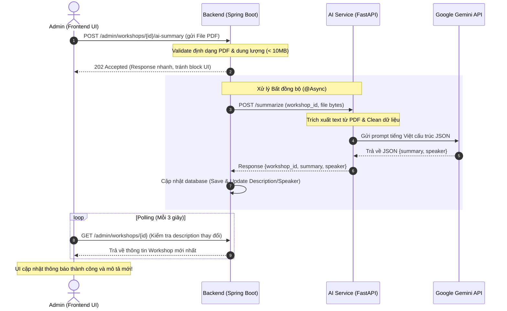

# KỊCH BẢN THUYẾT TRÌNH VÀ DEMO KỸ THUẬT: QUẢN LÝ WORKSHOP & AI SUMMARY
> **Quy trình trình bày:** Phân tích Kiến trúc & Mã nguồn Backend trước ➔ Thuyết minh UI & Thao tác Demo sau.

Tài liệu này cung cấp kịch bản chi tiết từng bước phục vụ việc thuyết trình/demo hệ thống quản lý Workshop. Kịch bản được chia làm 3 phần trực quan, được thiết kế theo thứ tự **Trình bày kỹ thuật Backend trước, thao tác UI sau** nhằm nêu bật năng lực thiết kế hệ thống và giải quyết nghiệp vụ dưới DB/Server-side.

---

## 🗺️ TỔNG QUAN CÁC FILE MÃ NGUỒN CẦN TRÌNH BÀY

Dưới đây là sơ đồ ánh xạ giữa các tính năng và các file mã nguồn tương ứng trong dự án để bạn dễ dàng mở sẵn trên IDE:

| Phân hệ / Tính năng | Backend (Spring Boot & JPA) | AI Service (FastAPI & Gemini API) | Frontend (React & Axios) |
| :--- | :--- | :--- | :--- |
| **Phần 1: Tạo Workshop** | [AdminWorkshopController.java](./backend/src/main/java/com/unihub/backend/controller/AdminWorkshopController.java)<br>[WorkshopService.java](./backend/src/main/java/com/unihub/backend/service/WorkshopService.java) | *Không tham gia* | [WorkshopFormModal.jsx](./frontend/src/components/workshops/WorkshopFormModal.jsx)<br>[adminWorkshopService.js](./frontend/src/services/adminWorkshopService.js) |
| **Phần 2: Quản lý Khác** *(Edit, Cancel, Stats, Attendances)* | [AdminWorkshopController.java](./backend/src/main/java/com/unihub/backend/controller/AdminWorkshopController.java)<br>[WorkshopService.java](./backend/src/main/java/com/unihub/backend/service/WorkshopService.java) | *Không tham gia* | [Dashboard.jsx](./frontend/src/pages/Dashboard.jsx) |
| **Phần 3: AI Summary** | [AdminWorkshopController.java](./backend/src/main/java/com/unihub/backend/controller/AdminWorkshopController.java)<br>[WorkshopAiService.java](./backend/src/main/java/com/unihub/backend/service/WorkshopAiService.java) | [summarize.py](./ai-service/routers/summarize.py)<br>[llm_client.py](./ai-service/services/llm_client.py) | [Dashboard.jsx](./frontend/src/pages/Dashboard.jsx)<br>*(AI upload & Polling)* |

---

## 🪵 SƠ ĐỒ LUỒNG ĐỒNG BỘ AI SUMMARY (BẤT ĐỒNG BỘ)



---

## 📘 PHẦN 1: TẠO WORKSHOP & RÀNG BUỘC NGHIỆP VỤ

### 1. Mục đích của chức năng (Thuyết minh đầu tiên)
* **Mục tiêu thực tế:** 
  * Giúp Ban tổ chức (Admin) lên kế hoạch và khởi tạo các sự kiện Workshop mới trên hệ thống với đầy đủ thông tin cốt lõi (têu đề, mô tả, phòng học, số lượng slots, diễn giả, giá vé).
  * Tự động hóa việc kiểm duyệt và áp đặt các quy tắc nghiệp vụ khắt khe về thời gian (phải diễn ra cùng ngày, đóng cổng đăng ký trước 24h) và giới hạn sức chứa của phòng, triệt tiêu sai sót của con người.
  * Chuẩn bị sẵn sàng hạ tầng khóa chỗ trên bộ nhớ đệm (Redis Slots) để đón nhận luồng đăng ký cực lớn của sinh viên mà không lo nghẽn mạng hay quá tải.

### 2. Công nghệ & Kỹ thuật áp dụng
* **Spring Validation (`@Valid` & `@RequestBody`):** Ràng buộc và tự động hóa validate dữ liệu đầu vào chuẩn ngay từ Controller.
* **Spring Method Security (`@PreAuthorize`):** Bảo vệ API dựa trên vai trò (Role-Based Access Control) ngay tại Gateway/Controller.
* **Service Business Validation Engine:** Module kiểm duyệt độc lập các quy định nghiệp vụ phức tạp ở Service Layer trước khi lưu DB.
* **Redis Counter & Cache Allocation:** Khởi tạo bộ đếm số ghế trống lên Redis đệm ngay khi tạo nhằm giảm tải I/O cho DB SQL, giúp khóa chỗ tức thời ở mức micro giây khi mở đăng ký.

### 3. Kiến trúc Kỹ thuật & Backend Code (Thuyết minh tiếp theo)
> **Mục tiêu:** Chứng minh khả năng thiết kế cơ sở dữ liệu, validate dữ liệu nghiêm ngặt ở Server-side, và giải pháp lưu trữ hiệu năng cao chống Overbooking với Redis.

#### 📂 File 1: `AdminWorkshopController.java`
* **API Endpoint:** `@PostMapping` ánh xạ vào `/api/v1/admin/workshops`.
* **Phân quyền (Authorization):** Sử dụng annotation `@PreAuthorize("hasRole('ADMIN')")` để chặn truy cập trái phép ngay từ tầng Controller.
* **Validate dữ liệu:** Annotation `@Valid` kết hợp `@RequestBody WorkshopRequest` tự động bắt lỗi định dạng trước khi dữ liệu đi vào tầng Service.

#### 📂 File 2: `WorkshopService.java`
* **Phương thức chính `createWorkshop`:**
  * Tra cứu thực thể `Room` để kiểm tra sức chứa.
  * **Hàm `validateBusinessRules` - Bộ quy tắc nghiệp vụ cốt lõi:**
    1. *Cùng một ngày (Same-day):* Bắt buộc `startTime` và `endTime` phải cùng ngày (G24).
    2. *Thời hạn đăng ký:* `registrationStartTime` < `registrationEndTime` và `registrationStartTime` < `startTime`.
    3. *Độ trễ đóng đăng ký (Rule 24h):* Thời điểm đóng đăng ký phải cách thời điểm bắt đầu Workshop **ít nhất 24 giờ** (`hoursBetween < 24` sẽ ném ra `IllegalArgumentException`).
    4. *Sức chứa phòng:* Tổng số ghế của workshop (`totalSlots`) không được vượt quá sức chứa của phòng (`room.getCapacity()`).
  * **Đồng bộ hàng đợi chỗ trống Redis:** Gọi hàm `seatLockingService.initSlots(...)` để khởi tạo số lượng chỗ trống lên bộ nhớ đệm **Redis** với thời gian sống (TTL) tính toán tự động dựa trên thời hạn đăng ký.
  * **Trạng thái khởi tạo:** Bản ghi ban đầu luôn được lưu với trạng thái mặc định là `DRAFT` (Nháp) để kiểm soát chất lượng trước khi công bố công khai.

---

### 4. Luồng UI & Thao tác Giao diện (Thuyết minh sau)
> **Mục tiêu:** Chỉ ra cách giao diện tương tác với các API của Backend và cách UI tối ưu hóa trải nghiệm nhập liệu của người dùng dựa trên luật nghiệp vụ đã học ở Backend.

#### 📂 File 3: `WorkshopFormModal.jsx`
* **Thiết kế Form thông minh:** Thay vì cho chọn ngày giờ tùy ý, giao diện gom thành một ô chọn ngày duy nhất (`workshopDate`) và hai ô chọn giờ (`workshopStartTime`, `workshopEndTime`) để triệt tiêu lỗi khác ngày từ đầu.
* **Validate động:** Frontend tự động tính toán `maxRegistrationEndTime` (lùi 24 tiếng từ giờ bắt đầu) và truyền vào thuộc tính `max` của thẻ input chọn giờ đóng cổng đăng ký, giúp ngăn chặn lỗi chọn sai giờ ngay trên UI.
* **API Service gọi Server:** `adminWorkshopService.js` thực hiện cuộc gọi `axiosClient.post('/admin/workshops', data)`.

#### 💻 Kịch bản thao tác & Lời thoại demo thực tế
> **"Kính thưa Hội đồng và các bạn, tôi xin trình bày phân hệ đầu tiên: Tạo mới Workshop. Đầu tiên, mục đích của chức năng này là giúp ban tổ chức dễ dàng lập kế hoạch và tự động áp đặt các luật nghiệp vụ khắt khe. Để giải quyết bài toán này một cách tối ưu, chúng tôi đã áp dụng các kỹ thuật cốt lõi bao gồm: Spring Validation và Security phân quyền tại Controller, xây dựng bộ Validation Engine độc lập tại Service, và đặc biệt là giải pháp đồng bộ số lượng ghế trống lên bộ nhớ đệm hiệu năng cao Redis Counter nhằm ngăn chặn triệt để tình trạng Overbooking với hiệu năng tốt nhất. Sau đây, tôi xin trình bày kiến trúc và mã nguồn Backend xử lý nghiệp vụ này trước, sau đó sẽ demo thao tác thực tế trên giao diện.**
> 
> *[Mở file AdminWorkshopController.java trên IDE]*
> 
> **Đầu tiên, tại tầng API Controller, chúng tôi thiết lập endpoint @PostMapping dành riêng cho quản trị viên, được bảo vệ nghiêm ngặt bằng phân quyền @PreAuthorize("hasRole('ADMIN')").**
> 
> *[Mở file WorkshopService.java tại hàm createWorkshop và validateBusinessRules]*
> 
> **Khi request đi vào WorkshopService, hệ thống sẽ thực thi hàm validateBusinessRules. Tại đây, các điều kiện nghiệp vụ cốt lõi được thắt chặt: thời gian bắt đầu và kết thúc phải cùng một ngày, số ghế đăng ký không được vượt quá sức chứa của phòng thực tế. Đặc biệt là quy định đóng cổng đăng ký trước khi sự kiện diễn ra ít nhất 24 giờ. Nếu vi phạm, hệ thống lập tức ném ra lỗi ngoại lệ để bảo toàn tính đúng đắn của dữ liệu.**
> **Sau khi lưu Workshop mới dưới dạng DRAFT vào DB, hệ thống sẽ thực hiện một bước cực kỳ quan trọng: gọi seatLockingService.initSlots() để khởi tạo số lượng chỗ trống lên bộ đệm Redis. Việc này giúp chặn đứng các luồng đăng ký quá số lượng (Overbooking) một cách tối ưu.**
> 
> *[Bật trình duyệt lên màn hình Web UI, click nút "Create Workshop" để hiện Modal]*
> 
> **Bây giờ, chúng ta hãy xem luồng giao diện hoạt động ra sao để tương tác với API Backend này.**
> **Như mọi người thấy, để hỗ trợ tốt nhất cho luật nghiệp vụ cùng ngày và đóng cổng đăng ký trước 24 giờ của Backend, giao diện React được thiết kế thông minh chỉ có một ô chọn Ngày duy nhất, kèm theo cơ chế tự động giới hạn thời gian chọn tối đa trên ô nhập giờ đăng ký.**
> 
> *[Thao tác gõ thử tiêu đề, chọn phòng Capacity là 60 người, nhưng cố tình nhập số ghế là 100 ghế rồi nhấn Create]*
> 
> **Hệ thống sẽ ngay lập tức bắt lỗi. Điều này chứng minh sự phối hợp nhịp nhàng giữa việc ngăn chặn sớm ở Client và việc kiểm tra nghiêm ngặt bằng API ở Backend."**

---

## ⚙️ PHẦN 2: CÁC CHỨC NĂNG QUẢN LÝ KHÁC
*(Phân trang, Chỉnh sửa, Kích hoạt, Thống kê trực quan, Điểm danh & Hủy Workshop)*

### 1. Mục đích của chức năng (Thuyết minh đầu tiên)
* **Mục tiêu thực tế:**
  * **Phân trang danh sách:** Hỗ trợ Admin dễ dàng theo dõi, tìm kiếm và quản lý số lượng lớn các Workshop một cách có tổ chức, tối ưu hóa thời gian tải trang.
  * **Chỉnh sửa & Công bố:** Cho phép sửa đổi thông tin an toàn (ví dụ: nâng/hạ số ghế dựa trên lượng đăng ký thực tế) và chuyển trạng thái sang `PUBLISHED` khi sẵn sàng mở cổng.
  * **Thống kê & Điểm danh:** Cung cấp báo cáo tỷ lệ lấp đầy (Fill Rate) trực quan theo thời gian thực và quản lý danh sách điểm danh (Attendance) thông qua việc quét mã QR đồng bộ từ thiết bị di động.
  * **Hủy Workshop khẩn cấp:** Xử lý quy trình hủy bỏ Workshop bị sự cố một cách tự động, công bằng và minh bạch tài chính (bulk-cancel hàng loạt đơn đăng ký, lưu vết giao dịch để hoàn tiền, giải phóng cache chỗ ngồi và gửi email thông báo tự động).

### 2. Công nghệ & Kỹ thuật áp dụng
* **Spring Data JPA Pagination (`Pageable`, `Page`):** Phân trang dữ liệu ở tầng cơ sở dữ liệu để tối ưu bộ nhớ đệm và thời gian phản hồi API.
* **Ràng buộc giá vé (Price Integrity Check):** Chặn đứng hành vi thay đổi giá vé của Workshop nếu đã có bất cứ lượt đăng ký nào tồn tại (`existsByWorkshopId`) nhằm bảo vệ tính toàn vẹn của lịch sử giao dịch và tài chính.
* **Bulk-Update Query (`@Modifying` & `@Query`):** Câu truy vấn cập nhật trạng thái hàng loạt đăng ký chỉ bằng 1 câu lệnh SQL duy nhất giúp giảm thiểu số lượng Database transactions.
* **Spring Transaction Synchronization:** Đồng bộ hóa logic cập nhật số ghế trên Redis chỉ sau khi Transaction lưu Database SQL đã commit thành công.
* **Spring Application Event Listener:** Phát sự kiện `WorkshopCancelledEvent` bất đồng bộ để kích hoạt hệ thống Notification gửi email/thông báo mà không làm block luồng gọi API hủy.
* **React Recharts & Dynamic State:** Sử dụng biểu đồ vector SVG để vẽ báo cáo động dựa trên State đồng bộ từ Backend.

### 3. Kiến trúc Kỹ thuật & Backend Code (Thuyết minh tiếp theo)
> **Mục tiêu:** Giới thiệu các chức năng chỉnh sửa, kích hoạt, điểm danh, truy vấn thống kê thời gian thực từ Redis, và quy trình xử lý giao dịch vô cùng phức tạp khi hủy bỏ một Workshop đã bán vé.

#### 📂 File 1: `AdminWorkshopController.java`
* Các endpoint quản lý phong phú:
  * `updateWorkshop` (`PUT /{id}`): Sửa thông tin.
  * `publishWorkshop` (`PUT /{id}/publish`): Công bố Workshop (chỉ áp dụng cho DRAFT).
  * `cancelWorkshop` (`PUT /{id}/cancel`): Hủy Workshop khẩn cấp.
  * `getWorkshopStats` (`GET /{id}/stats`): Lấy số liệu lấp đầy chính xác.
  * `getWorkshopAttendances` (`GET /{id}/attendances`): Trả về danh sách điểm danh phân trang, sắp xếp ưu tiên sinh viên đã check-in lên đầu hàng.

#### 📂 File 2: `WorkshopService.java`
* **Logic cập nhật chỗ ngồi thông minh (`updateWorkshop`):**
  * Sức chứa ghế của workshop (`totalSlots`) chỉ được sửa khi ở trạng thái `DRAFT`. Nếu đã công bố, hệ thống cấm chỉnh sửa tổng số ghế.
  * Kiểm tra và ngăn chặn không cho phép giảm tổng số ghế xuống thấp hơn số lượng sinh viên đã đăng ký và thanh toán thành công (`successfulCount`).
  * **Kiểm soát giá vé an toàn (Price Integrity Check):** Ngăn chặn không cho phép cập nhật `price` (giá vé) nếu workshop đó đã có ít nhất một lượt đăng ký trong DB (`registrationRepository.existsByWorkshopId(id)`). Nếu vi phạm, ném ra lỗi `ConflictException` (409).
  * **Transaction Synchronization:** Khi số ghế thay đổi hợp lệ, hệ thống sử dụng `TransactionSynchronizationManager.registerSynchronization` để chỉ thực hiện đồng bộ lại số chỗ trên Redis sau khi Transaction ghi dữ liệu xuống Database SQL thành công trọn vẹn.
* **Quy trình hủy liên hoàn (`cancelWorkshop`):**
  1. Chuyển trạng thái thực thể Workshop thành `CANCELLED`.
  2. Thực hiện **`bulkCancelByWorkshopId`** để chuyển đổi hàng loạt các lượt đăng ký ở trạng thái `SUCCESS` và `PENDING` thành `CANCELLED` trong **1 câu truy vấn SQL duy nhất** để tránh lãng phí tài nguyên CPU.
  3. **Bảo lưu thông tin thanh toán:** Hệ thống tuyệt đối không sửa đổi hay xóa bảng thanh toán (`Payment` ở trạng thái `COMPLETED` được giữ nguyên) để phục vụ công tác đối soát hoàn tiền (Refund Reconciliation) sau này.
  4. Xóa khóa chỗ trống trên Redis (`seatLockingService.removeSlots`) để tuyệt đối chặn đứng các sinh viên cố đăng ký chui.
  5. Phát ra sự kiện `WorkshopCancelledEvent` bất đồng bộ thông qua Spring ApplicationEvent để hệ thống Notification tự động gửi thư xin lỗi và hướng dẫn nhận lại tiền cho người dùng.

---

### 4. Luồng UI & Thao tác Giao diện (Thuyết minh sau)
> **Mục tiêu:** Trình bày cách giao diện Admin Dashboard hiển thị thông tin phân trang mượt mà, vẽ biểu đồ thống kê bằng Recharts và kích hoạt các modal xác nhận trước khi gọi API nghiệp vụ nguy hiểm.

#### 📂 File 3: `Dashboard.jsx`
* **Phân trang Dynamic:** Gọi hàm `adminWorkshopService.getAll` truyền số trang `page` hiện tại, Backend sẽ trả về cấu trúc phân trang chuẩn `PageResponse`.
* **Vẽ biểu đồ Recharts:** Modal thống kê sử dụng component `<BarChart />` và `<ResponsiveContainer />` để biểu diễn trực quan tương quan giữa số ghế đã đặt (`Registered`) và số ghế còn trống (`Available`) theo thời gian thực.
* **Modal xác nhận hủy:** Hộp thoại cảnh báo màu cam nổi bật thông tin rõ ràng về việc hệ thống sẽ tự động hủy các đăng ký liên quan và hoàn tiền.

#### 💻 Kịch bản thao tác & Lời thoại demo thực tế
> **"Tiếp theo, tôi xin đi sâu vào các chức năng quản lý khác như Phân trang, Cập nhật, Thống kê, Điểm danh và Hủy Workshop. Mục đích của nhóm chức năng này là giúp ban tổ chức theo dõi sát sao tình hình đăng ký, linh hoạt điều chỉnh quy mô ghế, điểm danh người tham dự thông qua quét QR, và đặc biệt là xử lý an toàn quy trình hủy workshop khẩn cấp mà vẫn bảo toàn tính minh bạch tài chính. Nhóm chức năng này được thiết kế để tối ưu hóa vận hành quy mô lớn với các giải pháp kỹ thuật cụ thể: Sử dụng Spring Data Pageable để phân trang phía Server-side tối ưu truy vấn DB, áp dụng Bulk-Update Query thực hiện cập nhật hàng loạt đơn đăng ký chỉ trong 1 câu SQL duy nhất để tối ưu hiệu năng DB, sử dụng Transaction Synchronization đồng bộ Redis chỉ sau khi Database commit thành công, và bắn Spring Event bất đồng bộ để xử lý gửi thông báo ngầm. Đồng thời phía Frontend tích hợp Recharts vẽ đồ thị dữ liệu mượt mà. Sau đây, chúng ta hãy cùng xem các logic Backend xử lý những nghiệp vụ này như thế nào.**
> 
> *[Mở file WorkshopService.java trên IDE tại hàm updateWorkshop và cancelWorkshop]*
> 
> **Ở Backend, khi chỉnh sửa thông tin Workshop, chúng tôi đảm bảo số ghế không bao giờ bị giảm xuống dưới số lượng người đã đăng ký thành công nhằm bảo vệ quyền lợi sinh viên. Toàn bộ thao tác cập nhật số ghế này chỉ được đồng bộ lên Redis sau khi Database đã commit hoàn tất nhờ cơ chế TransactionSynchronizationManager. Đặc biệt, để đảm bảo tính toàn vẹn của dữ liệu giao dịch tài chính, hệ thống kiểm tra chặt chẽ: nếu phát hiện có bất cứ lượt đăng ký nào đã tồn tại, hệ thống sẽ tuyệt đối ngăn chặn việc sửa đổi giá vé của Workshop và ném ra lỗi ConflictException.**
> **Đối với nghiệp vụ hủy Workshop đã xuất bản, tầng Service sẽ xử lý một quy trình vô cùng chặt chẽ: bulk-update chuyển toàn bộ đăng ký liên quan thành CANCELLED trong một câu lệnh duy nhất để tối ưu hiệu năng, giữ nguyên trạng thái thanh toán COMPLETED để đối soát hoàn tiền, xóa key Redis và bắn ra Event để hệ thống thông báo gửi email đền bù bất đồng bộ.**
> 
> *[Bật trình duyệt lên màn hình Web UI Dashboard]*
> 
> **Để hiển thị lượng dữ liệu lớn từ Backend, trang quản trị Dashboard của chúng tôi được phân trang toàn diện, giao diện hiển thị các trạng thái trực quan.**
> 
> *[Thao tác trên giao diện: Click mở dropdown menu "View Statistics" của một Workshop đang có người đăng ký]*
> 
> **Mọi người có thể thấy biểu đồ phân phối chỗ ngồi ngang Real-time được vẽ động vô cùng chuyên nghiệp bằng Recharts, tính toán chính xác tỷ lệ lấp đầy ghế dựa trên dữ liệu chuẩn từ Backend.**
> 
> *[Thao tác trên giao diện: Click chọn "Cancel Workshop" và xác nhận]*
> 
> **Khi tôi nhấn Hủy Workshop, hệ thống lập tức gọi API hủy khẩn cấp. Ở giao diện lập tức cập nhật trạng thái CANCELLED, đồng thời cổng đăng ký bị đóng băng ngay lập tức, chứng minh luồng nghiệp vụ Backend đã thực thi trọn vẹn và an toàn."**

---

## 🤖 PHẦN 3: TỰ ĐỘNG TÓM TẮT NỘI DUNG VÀ TRÍCH XUẤT DIỄN GIẢ BẰNG AI

### 1. Mục đích của chức năng (Thuyết minh đầu tiên)
* **Mục tiêu thực tế:**
  * Giải phóng tối đa công sức vận hành của ban tổ chức. Thay vì phải đọc slide tài liệu hàng chục trang để tự tay soạn thảo mô tả tóm tắt và tìm kiếm thông tin diễn giả chính, Admin chỉ cần tải file tài liệu (PDF) của buổi workshop lên hệ thống.
  * Hệ thống tự động phân tích văn bản, sử dụng AI (Gemini API) để biên soạn một mô tả ngắn gọn súc tích 3-5 câu tiếng Việt chất lượng cao và tự động phát hiện chính xác tên diễn giả (Speaker), tự động cập nhật lên UI trong vài giây mà không cần nhập thủ công.

### 2. Công nghệ & Kỹ thuật áp dụng
* **Asynchronous Thread Pool (`@Async` & `AsyncTaskExecutor`):** Cơ chế xử lý luồng ngầm bất đồng bộ của Spring Boot giúp trả về mã HTTP `202 Accepted` tức thì để không block trình duyệt của người dùng.
* **Python FastAPI Service (Microservice Architecture):** Kiến trúc dịch vụ phân tán, sử dụng Python tối ưu các tác vụ xử lý file PDF và LLM.
* **Google Generative AI SDK (Gemini 1.5 Flash):** Tích hợp mô hình Generative AI hiện đại với kỹ thuật cấu trúc prompt để sinh dữ liệu JSON an toàn có cấu trúc.
* **Robust Failover & Text Extraction:** Bóc tách chữ thô từ byte stream (`PyPDF2`/`pdfplumber`), làm sạch văn bản, và thuật toán chuyển đổi sang mô hình dự phòng (Fallback) tự động.
* **HTTP Polling Algorithm:** Giải thuật Polling phía React Client sử dụng `setTimeout` nhẹ nhàng giúp UI tự động đồng bộ khi luồng ngầm hoàn tất.

### 3. Kiến trúc Bất đồng bộ & AI Service Kỹ thuật (Thuyết minh tiếp theo)
> **Mục tiêu:** Thuyết minh quy trình kết hợp kiến trúc Microservice bất đồng bộ: Java Spring Boot xử lý nghiệp vụ, Python FastAPI giao tiếp mô hình AI (Gemini 1.5 Flash) để trích xuất dữ liệu có cấu trúc từ slide/file PDF tài liệu workshop.

```
[UI Upload] ─(1. File PDF)─> [Spring Boot Controller] 
                                    │
                              (2. Đọc byte & trả về 202 Accepted tức thì)
                                    │
                                    ├───> Trả response cho UI ────> [Polling UI check mô tả]
                                    │
                              (3. Luồng phụ @Async chạy ngầm)
                                    │
                                    └───> [FastAPI Router] ─(4. Trích xuất text)─> [Gemini API]
                                                                                        │
                                                                                 (5. JSON Trả về)
                                                                                        │
                                    [DB: Update Mô tả & Diễn giả] <────(6. Trả kết quả)─┘
```

#### 📂 File 1: `AdminWorkshopController.java`
* **API tiếp nhận File PDF:** `@PostMapping(value = "/{id}/ai-summary", consumes = "multipart/form-data")`.
* **Đọc dữ liệu an toàn trên Main Thread:** Gọi `file.getBytes()` ngay trên Main Thread trước khi trả về HTTP Response. Điều này ngăn việc máy chủ Tomcat tự động xóa tệp tạm trong thư mục lưu trữ tạm thời khi HTTP request ban đầu kết thúc.
* **Kiến trúc phản hồi nhanh:** Gọi phương thức bất đồng bộ `generateSummaryAsync` và trả về HTTP Status `202 ACCEPTED` ngay lập tức để giải phóng tài nguyên mạng cho Client.

#### 📂 File 2: `WorkshopAiService.java`
* **Xử lý ngầm với `@Async`:**
  * Annotation `@Async` chỉ thị cho Spring Boot chạy phương thức này trên một Executor Thread riêng biệt.
  * Sử dụng `RestTemplate` đóng gói dữ liệu mảng byte gửi một yêu cầu `multipart/form-data` sang cổng microservice Python FastAPI `/summarize`.
  * Sau khi nhận phản hồi, hệ thống bóc tách dữ liệu JSON sạch, tự động gọi `workshopRepository.updateDescription(...)` để cập nhật mô tả tóm tắt mới và điền thông tin người thuyết trình (`speaker`) nếu AI nhận diện được trong tài liệu.

#### 📂 File 3: `summarize.py (FastAPI)`
* Router Python tiếp nhận byte stream từ Java Backend, chuyển đổi sang luồng bộ nhớ đệm `io.BytesIO`, thực hiện trích xuất chữ bằng `pdf_extractor` và gọi thư viện LLM Client.

#### 📂 File 4: `llm_client.py (FastAPI)`
* **Hàm `generate_summary_and_speaker`:**
  * Sử dụng thư viện SDK `google-generativeai` để giao tiếp với mô hình **Gemini 1.5 Flash**.
  * **System Prompt tiếng Việt thắt chặt JSON:** Ra lệnh cho AI trả về định dạng JSON thuần không markdown, bắt buộc có đúng 2 trường: `"summary"` (tóm tắt súc tích 3-5 câu tiếng Việt) và `"speaker"` (tên diễn giả chính nếu tài liệu có ghi rõ nhãn như 'Giảng viên', 'Diễn giả', 'Speaker', ...).
  * **Cơ chế Fallback Model thông minh:** Nếu mô hình chính bị lỗi hoặc hết hạn mức sử dụng (Quota), hệ thống tự động quét danh sách các model Google đang hoạt động của tài khoản để chọn ra model thay thế thích hợp khác, đảm bảo tính sẵn sàng cao của hệ thống.
  * **Làm sạch tiền đề LLM:** Hàm `_strip_summary_preamble` loại bỏ các câu dẫn rườm rà dư thừa của AI (ví dụ: *"Dưới đây là tóm tắt..."*) để đảm bảo dữ liệu lưu trữ luôn chuyên nghiệp và sạch đẹp nhất.

---

### 4. Luồng UI & Thao tác Giao diện (Thuyết minh sau)
> **Mục tiêu:** Demo quy trình tải tài liệu lên, hiển thị trạng thái chờ xử lý ngầm, và cách Frontend React sử dụng cơ chế Polling thông minh để tự động nhận dạng cập nhật dữ liệu từ Server mà không cần làm mới (F5) trang.

#### 📂 File 5: `Dashboard.jsx`
* **Hàm Polling thông minh `pollAiDescriptionUpdate`:**
  * Khi nhấn gửi file PDF lên Backend, giao diện nhận ngay mã `202 Accepted` và kích hoạt hàm Polling ngầm.
  * Sử dụng `setTimeout` để gửi yêu cầu kiểm tra trạng thái Workshop mỗi 3 giây (Timeout tối đa 2 phút) xem mô tả mới có khác mô tả cũ hay không.
  * Ngay khi phát hiện có nội dung mô tả mới từ Backend, UI tự động đóng modal, hiển thị Toast thông báo thành công rực rỡ và cập nhật bảng hiển thị dữ liệu tức thì.

#### 💻 Kịch bản thao tác & Lời thoại demo thực tế
> **"Cuối cùng, tôi xin trình bày một tính năng đột phá mang lại giá trị thực tiễn rất lớn cho ban vận hành: Tự động tóm tắt nội dung tài liệu Workshop bằng Trí tuệ nhân tạo (AI Summary). Mục đích của chức năng này là giúp Admin bóc tách tài liệu và tự động soạn thảo mô tả chất lượng cao qua AI trong vài giây. Về giải pháp công nghệ, hệ thống kết hợp kiến trúc Microservice bất đồng bộ: Java Spring Boot xử lý ngầm qua luồng phụ `@Async` Thread Pool giúp trả về phản hồi HTTP `202 Accepted` ngay lập tức, Microservice Python FastAPI xử lý bóc tách PDF thô, và SDK Google Generative AI gọi mô hình Gemini 1.5 Flash thông qua các kỹ thuật System Prompt chặt chẽ để lấy dữ liệu JSON sạch cấu trúc. Phía Frontend tích hợp giải thuật HTTP Polling nhẹ nhàng qua setTimeout để UI tự cập nhật. Sau đây, chúng ta hãy cùng đi sâu vào kiến trúc và mã nguồn Backend xử lý."**
> 
> *[Mở file AdminWorkshopController.java tại hàm uploadAiSummary và WorkshopAiService.java tại hàm generateSummaryAsync trên IDE]*
> 
> **Điểm đặc biệt của tính năng này là kiến trúc Microservice bất đồng bộ. Tại tầng Backend Java Spring Boot, khi nhận file PDF, chúng tôi nhanh chóng đọc mảng byte dữ liệu trên Main Thread để tránh tệp tạm bị xóa, rồi lập tức đẩy tác vụ nặng sang một Thread độc lập nhờ annotation @Async và trả ngay HTTP 202 Accepted về cho Frontend.**
> **Tại luồng chạy ngầm của Java, hệ thống sẽ thực hiện cuộc gọi REST sang Microservice Python để bóc tách văn bản thô từ tài liệu.**
> 
> *[Mở file llm_client.py trên IDE]*
> 
> **Microservice Python của chúng tôi sử dụng thư viện Google Generative AI để gửi văn bản tài liệu kèm theo System Prompt thắt chặt định dạng JSON đến mô hình Gemini 1.5 Flash. AI sẽ tự động phân tích và bóc tách chính xác hai trường thông tin: mô tả tóm tắt nội dung workshop bằng tiếng Việt và tên diễn giả dựa trên các nhãn đặc trưng. Hệ thống còn được thiết kế cơ chế tự động chuyển đổi sang các model dự phòng Fallback khi mô hình chính gặp sự cố.**
> 
> *[Bật trình duyệt lên màn hình Web UI Dashboard, click mở menu "AI Summarize" của một Workshop trống]*
> 
> **Bây giờ tôi sẽ thực hiện thao tác demo trực quan luồng xử lý ngầm và khả năng cập nhật giao diện bất đồng bộ.**
> 
> *[Thao tác trên giao diện: Chọn 1 tệp PDF slide tài liệu đã chuẩn bị sẵn, nhấn "Upload & Summarize"]*
> 
> **Mọi người có thể thấy, giao diện lập tức phản hồi thông báo đang xử lý, người dùng hoàn toàn có thể cuộn trang làm việc khác mà không phải chờ đợi. Lúc này, ở Frontend đang chạy ngầm hàm Polling pollAiDescriptionUpdate liên tục hỏi Backend mỗi 3 giây để cập nhật trạng thái.**
> 
> *[Chờ 5-10 giây để AI xử lý xong. Modal tự động đóng, Toast thông báo Success màu xanh hiện lên và thông tin mô tả chi tiết bằng tiếng Việt cùng tên diễn giả tự động xuất hiện trên bảng]*
> 
> **Và tuyệt vời chưa ạ! Như mọi người thấy, tệp PDF đã được AI đọc, tóm tắt cực kỳ súc tích và tự động điền vào cả trường Mô tả lẫn Diễn giả trên màn hình mà tôi không cần phải tải lại trang thủ công. Sự kết hợp nhịp nhàng giữa xử lý bất đồng bộ ở Backend và Polling ở Frontend mang lại một trải nghiệm vận hành cực kỳ mượt mà và thông minh!"**

---

> [!IMPORTANT]
> **Các điểm lưu ý cốt lõi khi thuyết trình:**
> 1. **Giải thích rõ tại sao Backend Spring Boot phải đọc byte trước khi Async:** Do HTTP Request ban đầu kết thúc rất nhanh sau khi trả về 202, nếu không đọc byte ngay trên Main Thread thì Tomcat sẽ dọn dẹp và xóa sạch các file tạm đính kèm, dẫn tới luồng `@Async` phụ không thể đọc được file nữa.
> 2. **Sự kết hợp giữa 2 thế giới:** Nhấn mạnh thế mạnh của Java Spring Boot trong xử lý nghiệp vụ bảo mật và quản lý giao dịch dữ liệu, kết hợp với Python FastAPI trong việc linh hoạt tích hợp các thư viện AI và mô hình ngôn ngữ lớn (LLM).
